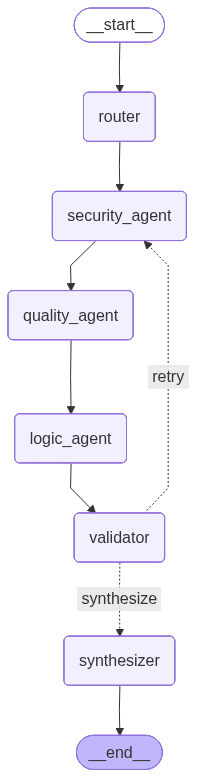

# Stateful Multi-Agent Code Review Pipeline

An automated, production-grade code analysis engine built on top of **LangGraph** and powered by a high-performance Large Language Model (LLM). This project demonstrates advanced LLM orchestration patterns, combining deterministic software engineering practices with non-deterministic language model capabilities to provide multi-dimensional static analysis.

---

##  System Architecture

The pipeline models a stateful runtime environment structured as a **Stateful Graph with a Cyclic Control Loop**. Instead of a single generalized prompt, the workload is distributed across specialized agent personas, governed by an automated quality gate.

### Core Graph Nodes

1. **Semantic Router (`router`)**
   * Acts as an LLM-based classifier evaluating the incoming source code. 
   * Dynamically constructs an execution blueprint based on structural requirements (e.g., activating security analysis for network/database I/O, or logic checking for complex algorithms).
   * Outputs a deterministic whitelist payload to direct downstream execution.

2. **Security Specialist (`security_agent`)**
   * Evaluates the code strictly for vulnerabilities: injection vectors (SQLi, XSS, Command Injection), insecure data handling, hardcoded secrets, and unsafe library usage.

3. **Quality & Idioms Specialist (`quality_agent`)**
   * Inspects naming conventions, maintainability, architectural smells, error-handling gaps, and adherence to SOLID design principles.

4. **Correctness & Logic Specialist (`logic_agent`)**
   * Conducts deep algorithmic reasoning to uncover edge-case failures, off-by-one errors, infinite loops, race conditions, and computational complexity ($O(n)$ footprint).

5. **Automated Quality Gate (`validator`)**
   * Evaluates the semantic substance and structural health of all previous agent responses.
   * Functions as a programmatic check to short-circuit the pipeline if responses are malformed or empty, triggering self-correction mechanisms.

6. **Aggregation Engine (`synthesizer`)**
   * Collects individual findings from the state layer, de-duplicates overlapping warnings, cross-references conflicts, and generates a structured, prioritized Markdown summary.

---

##  Key Architectural Patterns

### 1. Contextual Compounding (Sequential Topology)
The pipeline utilizes a sequential design pattern over a parallel fan-out approach to maximize **Token Efficiency** and **Contextual Depth**. By propagating data linearly, each subsequent agent inherits the structural state updates of preceding nodes. For example, the `logic_agent` can evaluate correctness while incorporating insights already uncovered by the `security_agent`, establishing an additive layer of context.

### 2. State Isolation & Single Source of Truth
The workflow relies on a unified, global `AgentState` schema managed via a central thread. Nodes are entirely decoupled from one another; they execute within isolated runtime environments, consuming from a read-only snapshot of the state and outputting discrete state deltas. The underlying graph coordinator updates the centralized schema, eliminating tight coupling between micro-agents.

### 3. Cyclic Self-Correction & Circuit Breakers
To handle hallucinations or incomplete reasoning, a cyclic conditional edge is established between the `validator` and the execution nodes. If the quality gate fails, the system executes a **runtime rollback**, resetting relevant keys and routing execution back for a targeted retry. To prevent infinite loops and runaway API expenditures, a deterministic counter variable (`retry_count`) acts as a hard **Circuit Breaker**, forcing the pipeline forward to synthesis if the max retry ceiling ($N=2$) is breached.

### 4. Defensive Boundary Parsing
All non-deterministic structured JSON outputs generated by the LLM layer are treated as untrusted payloads. The boundary where LLM data re-enters python execution logic is guarded by strict structural validation layers. If an agent returns malformed text or invalid keys, exceptions are caught immediately at the system boundary, applying hardcoded, safe default fallback configurations to ensure maximum uptime.
